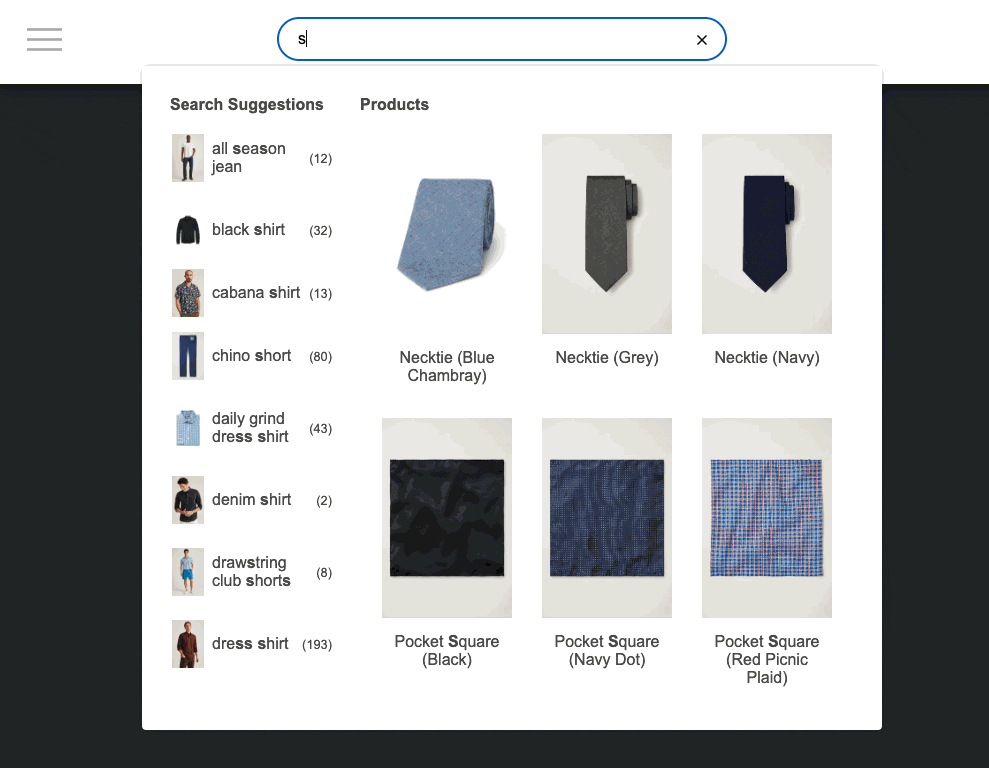

# Constructor.io Autocomplete UI Library

[](https://www.npmjs.com/package/@constructor-io/constructorio-ui-autocomplete)
[](https://github.com/Constructor-io/constructorio-ui-autocomplete/blob/main/LICENSE)

## Introduction

This UI Library provides React components that manage fetching and rendering logic for [Constructor.io's autosuggest services](https://constructor.com/solutions/search).

[Our storybook docs](https://constructor-io.github.io/constructorio-ui-autocomplete) are the best place to explore the behavior and configuration options for this UI Library.



## Installation

```bash
npm i @constructor-io/constructorio-ui-autocomplete
```

## Usage

### Using the React Component

The `CioAutocomplete` component handles state management, data fetching, and rendering logic.

```jsx
import { CioAutocomplete } from '@constructor-io/constructorio-ui-autocomplete';

function YourComponent() {
  return (
    <div>
      <CioAutocomplete apiKey="key_M57QS8SMPdLdLx4x" onSubmit={(e) => {console.log(e)}} />
    </div>
  );
```

### Using React Hooks

The `useCioAutocomplete` hook leaves rendering logic up to you, while handling:

- state management
- data fetching
- keyboard navigation
- mouse interactions
- focus and submit event handling

An `apiKey` or `cioJsClient` must be passed to the `useCioAutocomplete` hook along with an `onSubmit` callback function. All other values are optional.

```jsx
import { useCioAutocomplete } from '@constructor-io/constructorio-ui-autocomplete';

const args = {
  "apiKey": "key_M57QS8SMPdLdLx4x",
  "onSubmit": (submitEvent) => console.dir(submitEvent)
};

function YourComponent() {
  const {
    isOpen,
    sections,
    getFormProps,
    getLabelProps,
    getInputProps,
    getMenuProps,
    getItemProps,
    autocompleteClassName,
  } = useCioAutocomplete(args);

  return (
    <div className={autocompleteClassName}>
      <form {...getFormProps()}>
        <label {...getLabelProps()} hidden>
          Search
        </label>
        <input {...getInputProps()} />
      </form>
      <div {...getMenuProps()}>
        {isOpen && (
          <>
            {sections?.map((section) => (
              <div key={section.indexSectionName} className={section.indexSectionName}>
                <div className='cio-section'>
                  <div className='cio-section-name'>
                    {section?.displayName || section.indexSectionName}
                  </div>
                  <div className='cio-items'>
                    {section?.data?.map((item) => (
                      <div {...getItemProps(item)} key={item?.id}>
                        <div>
                          {item.data?.image_url && (
                            
                          )}
                          {item.groupName ? (
                            <p className='cio-term-in-group'>in {item.groupName}</p>
                          ) : (
                            <p>{item.value}</p>
                          )}
                        </div>
                      </div>
                    ))}
                  </div>
                </div>
              </div>
            ))}
          </>
        )}
      </div>
    </div>
  );
}
```

### Using the Javascript Bundle

This is a framework agnostic method that can be used in any JavaScript project. The `CioAutocomplete` function provides a simple interface to inject an entire Autocomplete UI into the provided `selector`.
In addition to [Autocomplete component props](https://constructor-io.github.io/constructorio-ui-autocomplete/?path=/docs/autocomplete-component--docs), this function also accepts `selector` and `includeCSS`.

```js
import CioAutocomplete from '@constructor-io/constructorio-ui-autocomplete/constructorio-ui-autocomplete-bundled';

CioAutocomplete({
  selector: '#autocomplete-container',
  includeCSS: true, // Include the default CSS styles. Defaults to true.
  apiKey: 'key_Gep3oQOu5IMcNh9A',
  onSubmit: (submitEvent) => console.dir(submitEvent),
  // ... additional arguments
});
```

## Custom Styling

### Library defaults

By default, importing react components or hooks from this library does not pull any css into your project.

If you wish to use some starter styles from this library, add an import statement similar to the example import statement below:

```js
import '@constructor-io/constructorio-ui-autocomplete/styles.css';
```

> Note: the path and syntax in this example may change slightly depending on your module bundling strategy

- These starter styles can be used as a foundation to build on top of, or just as a reference for you to replace completely.
- To opt out of all default styling, do not import the `styles.css` stylesheet.
- All starter styles in this library are scoped within the `.cio-autocomplete` css selector.
- These starter styles are intended to be extended by layering in your own css rules
- If you like, you can override the container's className like so:
  `autocompleteClassName='custom-autocomplete-container'`
- If you like, you can pass additional className(s) of your choosing like so:
  `autocompleteClassName='cio-autocomplete custom-autocomplete-container'`

## Troubleshooting

### Known Issues

**Older Javascript environments**

The library provides two different builds. CommonJS (cjs) and ECMAScript Modules (mjs) 

For ECMAScript Modules (mjs) build. The Javascript version is ESNext which might not be supported by your environment.
If that's the case and your environment is using an older Javascript version like ES6 (ES2015), you might get this error.

`Module parse failed: Unexpected token (15:32)
You may need an appropriate loader to handle this file type, currently no loaders are configured to process this file`

To solve this you can import the CommonJS (cjs) build which supports ES6 (ES2015) syntax:

`import CioAutocomplete from '@constructor-io/constructorio-ui-autocomplete/cjs'`

**ESLint**

There is a known issue with ESLint where it fails to resolve the paths exposed in the `exports` statement of NPM packages. If you are receiving the following error, you can safely disable ESLint using `// eslint-disable-line` for that line.

`Unable to resolve path to module '@constructor-io/constructorio-ui-autocomplete/styles.css'`

Relevant open issues:

[Issue 1868](https://github.com/import-js/eslint-plugin-import/issues/1868)

[Issue 1810](https://github.com/import-js/eslint-plugin-import/issues/1810)

## Local Development

### Development scripts

```bash
npm ci                  # install dependencies for local dev
npm run dev             # start a local dev server for Storybook
npm run lint            # run linter
```

## Publishing new versions

Dispatch the [Publish](https://github.com/Constructor-io/constructorio-ui-autocomplete/actions/workflows/publish.yml) workflow in GitHub Actions. You're required to provide two arguments:
- **Version Strategy**: `major`, `minor`, or `patch`.
- **Title**: A title for the release.

This workflow will automatically:
1. Bump the library version using the provided strategy.
2. Create a new git tag.
3. Create a new GitHub release.
4. Compile the library.
5. Publish the new version to NPM.
6. Publish the new version to our public CDN.
7. Deploy the Storybook docs to GitHub Pages.
8. Report the progress on the [relevant Slack channel](https://constructor.slack.com/archives/C061D3CFVR9).

#### ℹ️ Note: Please don't manually increase the package.json version or create new git tags.
The library version is tracked by releases and git tags. We intentionally keep the package.json version at `0.0.0` to avoid pushing changes to the `main` branch. This solves many security concerns by avoiding the need for branch-protection rule exceptions. 

## New Storybook Version

Dispatch the [Deploy Storybook](https://github.com/Constructor-io/constructorio-ui-autocomplete/actions/workflows/deploy-storybook.yml) workflow in GitHub Actions.

#### ℹ️ Note: This is already done automatically when publishing a new version.


## Supporting Docs

- [Storybook 7 Introduction](https://storybook.js.org/docs/7/get-started/setup)
- [Typescript Docs](https://www.typescriptlang.org/docs/)

## Usage examples
- [Javascript](https://codesandbox.io/s/autocomplete-ui-integration-plain-y9zjl7)
- [Remix App](https://codesandbox.io/p/sandbox/remix-example-for-constructorio-ui-autocomplete-kk5vh5?file=%2Fapp%2Froutes%2Findex.tsx)


## License
[MIT License](./LICENSE)
Copyright (c) 2022-present Constructor.io Corporation