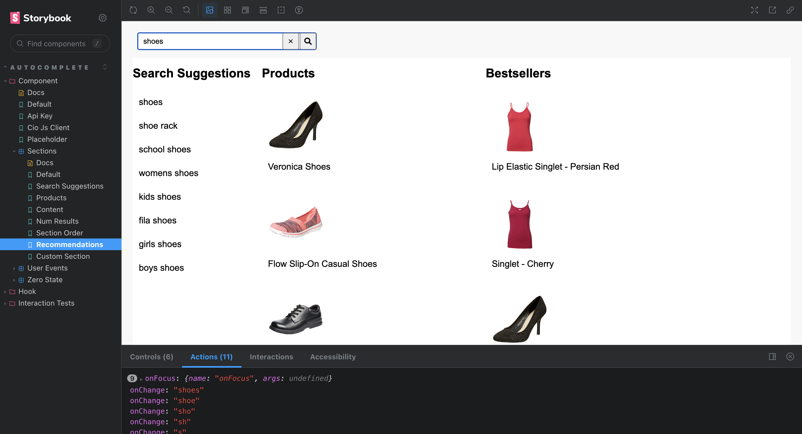
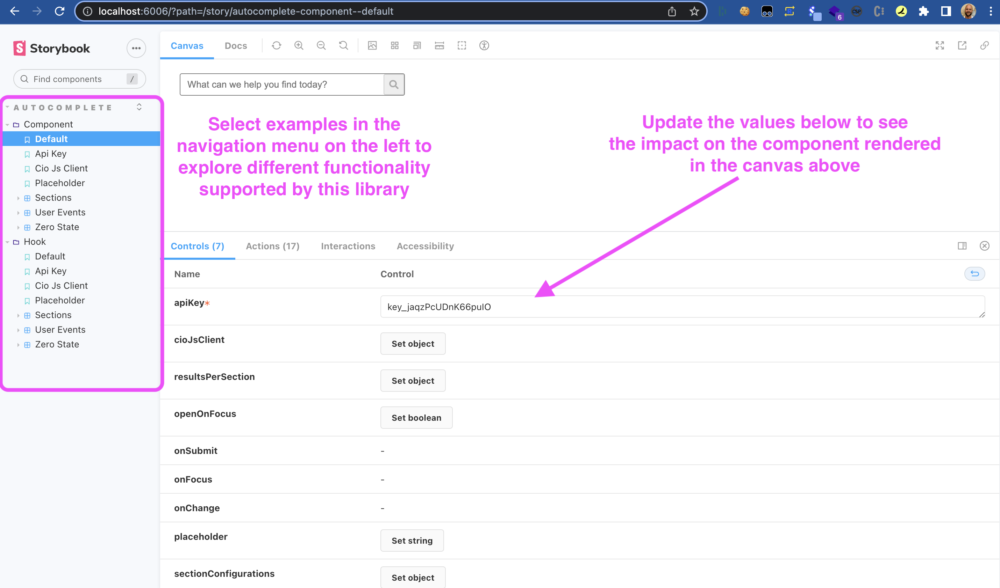
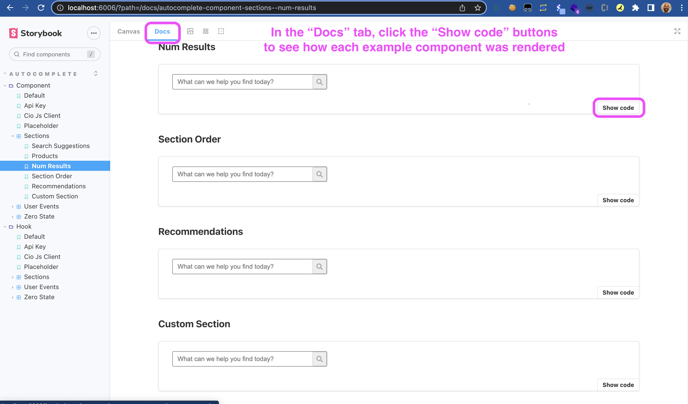
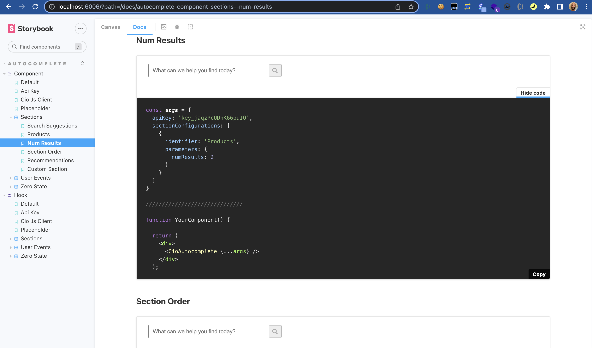

# Constructor.io Autocomplete UI Library

## Introduction

React Components that manage fetching and rendering logic for [Constructor.io's autocomplete services](https://constructor.io/products/autosuggest/).



## How to use this UI Library

There are two main methods for consuming this UI Library in a React project:

### Component based

The `CioAutocomplete` component handles state management, data fetching, and rendering logic.

```jsx
import { CioAutocomplete } from 'cio-autocomplete-ts';

function YourComponent() {
  return (
    <div>
      <CioAutocomplete apiKey="key_jaqzPcUDnK66puIO" />
    </div>
  );
```

### Hook based

The `useCioAutocomplete` hook handles state management and data fetching, but leaves rendering logic up to you.

```jsx
import { useCioAutocomplete } from 'cio-autocomplete-ts';

function YourComponent() {
  const { isOpen, sections, getFormProps, getInputProps, getMenuProps, getItemProps } =
    useCioAutocomplete({apiKey: "key_jaqzPcUDnK66puIO"});

  const { onSubmit, ...formProps } = getFormProps();

  return (
    <div className='cio-autocomplete'>
      <form className='cio-form' {...formProps} onSubmit={onSubmit}>
        <input {...getInputProps()} />
      </form>
      <div {...getMenuProps()}>
        {isOpen && (
          <div className='cio-results'>
            {sections?.map((section) => (
              <div key={section.identifier}>
                <div className='cio-section'>
                  <div className='cio-sectionName'>
                    {section?.displayName || section.identifier}
                  </div>
                  <div className='cio-items'>
                    {section?.data?.map((item, index) => (
                      <div
                        {...getItemProps({
                          item,
                          index,
                          sectionIdentifier: section.identifier
                        })}
                        className='cio-item'
                        key={item.value}>
                        <div>
                          {isProduct(item) && (
                            
                          )}
                          <p>{item.value}</p>
                        </div>
                      </div>
                    ))}
                  </div>
                </div>
              </div>
            ))}
          </div>
        )}
      </div>
    </div>
  );
};
```

## Explore Functionality with Storybook
The best was to get familiar with this UI Library is with storybook.




## Local Development

### Development scripts
```bash
npm ci                  # install dependencies for local dev
npm run storybook       # start a local dev server for Storybook
npm run lint            # run linter
```

### Maintain Library
```bash
npm run bundle            # generate library bundle ready for publishing
npm run build-storybook   # generate storybook bundled static page that can be deployed
```

## Supporting Docs
- [Storybook](https://storybook.js.org/docs/react/get-started/introduction)
- [Typescript Docs](https://www.typescriptlang.org/docs/)
- [Rollup](https://www.npmjs.com/package/rollup)
- [API Extractor](https://api-extractor.com/)